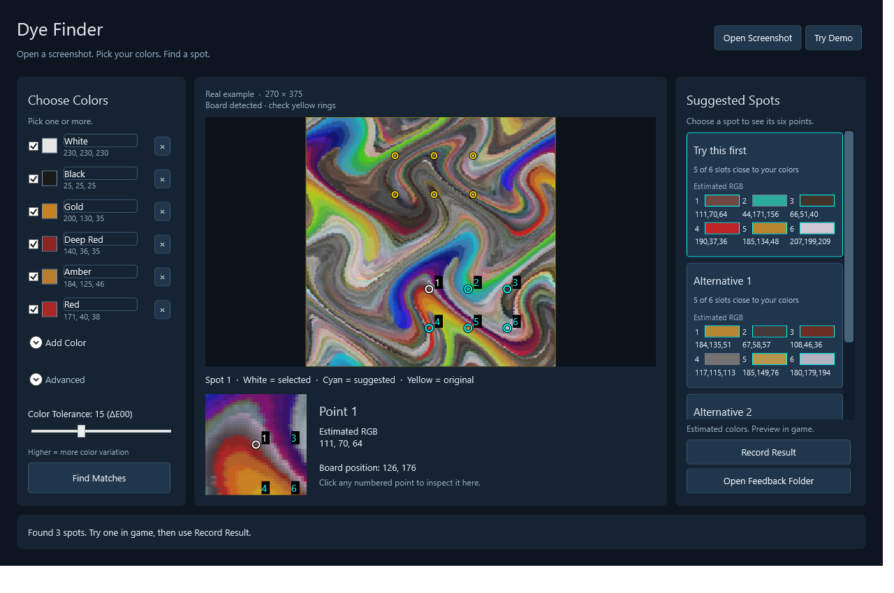
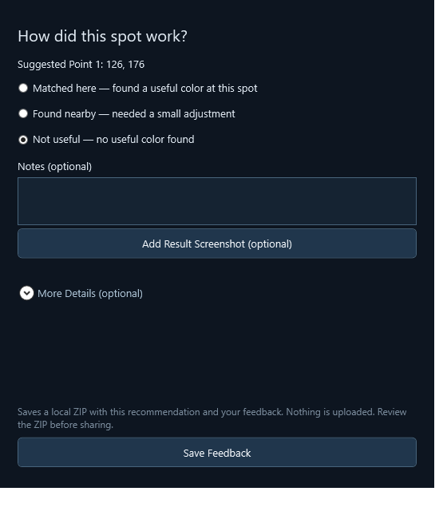

# Vindictus Dye Finder

Find useful dye positions from a Vindictus screenshot. Choose your colors, explore suggested spots, and preview the result in game.

**Windows x64 · Offline · Preview 0.3.2**

**[Download Windows x64 Portable ZIP](https://github.com/Noredge/vindictus-dye-finder/releases/download/v0.3.2/VindictusDyeFinder-0.3.2-win-x64.zip)** — extract the entire ZIP and open **VindictusDyeFinder.exe**. Keep all included files together. No installation or separate .NET runtime is needed.



*The app's built-in real example: choose colors on the left, inspect points in the center, and compare suggestions on the right.*

## Find a spot

1. **Open a screenshot.** Use **Open Screenshot**, drag in an image, or paste with **Ctrl+V**. **Try Demo** lets you explore the app immediately.
2. **Choose your colors.** Select presets or use **Add Color** to enter RGB values and an optional name. Click a color's name to rename it; your choices are saved between sessions.
3. **Find Matches.** Choose one of up to three **Suggested Spots**, then manually try that area in game.

Each suggestion shows its six estimated RGB values. **Cyan** rings mark suggested points, **yellow** rings mark the original crosses, and **white** marks the selected point. Click any numbered suggested point to inspect it in the single zoom preview below the board.

## Fine-tune the search

- **Color Tolerance:** increase it to accept more color variation. If no matches are found, a pale-yellow message prompts you to adjust the tolerance or choose another color, then search again.
- **Check the yellow rings:** they should line up with the original six crosses. If detection is off, use **Advanced** to select the board and mark the points manually.
- **Prefer easier alignment:** available under **Advanced** to favor nearby matching positions among suggestions with the same matching-slot count.

Use an original, unscaled screenshot for the best starting point. Colors are estimates; small adjustments may help, and clothing materials or lighting can change their appearance. Preview the result in game before committing to a dye.

## Record a result

Click **Record Result** after trying a suggestion. Choose **Matched here**, **Found nearby**, or **Not useful**. Notes and a cropped result screenshot are optional.



**Save Feedback** creates a local ZIP. Use **Open Feedback Folder** to find it, review its contents, and attach it to a [GitHub issue](https://github.com/Noredge/vindictus-dye-finder/issues) if you want to share your experience.

The app works offline and only analyzes images you provide. It does not capture your screen, control the game or upload feedback. Preferences and feedback stay in `%LOCALAPPDATA%/VindictusDyeFinder`.

## Build from source

With the .NET 10 SDK on Windows:

```powershell
./scripts/Build.ps1
./scripts/Test.ps1
./scripts/Publish.ps1 -Online
```

The portable build is written to `artifacts/win-x64-0.3.2`. Online publishing downloads the required runtime packages from NuGet.

## License

Application source and the paintbrush icon are [MIT licensed](LICENSE). Vindictus artwork shown in the demo and screenshots belongs to its respective owners; see [asset notices](src/DyeFinder.App/Assets/README.md).
